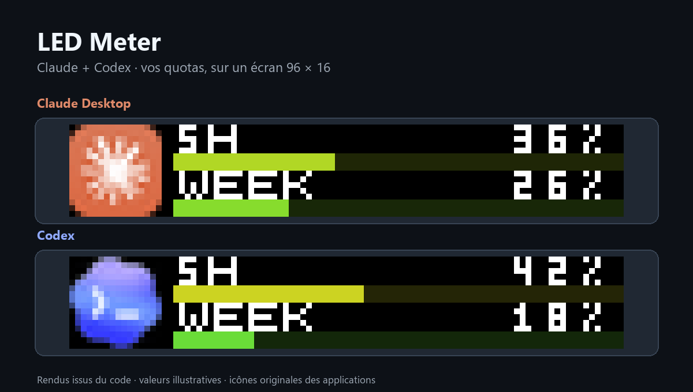
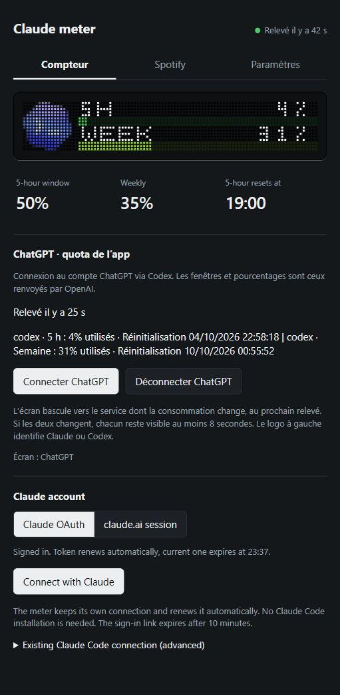

# LED Meter — Claude & Codex

Vos quotas Claude et ChatGPT/Codex sur une matrice LED **96 × 16**, avec un panneau web local, une bascule automatique selon la consommation et un affichage Spotify facultatif.

[Français](#français) · [English](#english) · [Installation Windows](#windows) · [Installation Raspberry Pi](#raspberry-pi)



*Rendus produits par le code du compteur, avec des valeurs illustratives. Les icônes originales sont centrées dans une colonne de 16 pixels à gauche.*

## Français

### Ce que vous voyez

- Deux barres de consommation : fenêtre courte et semaine lorsque ces limites sont disponibles.
- Le pourcentage **utilisé**, avec une couleur allant du vert au rouge.
- L’icône **Claude Desktop** ou le **nuage bleu Codex**, pour identifier immédiatement le compte affiché.
- Un panneau local avec les quotas des deux services, les réglages de l’écran et l’âge des derniers relevés.
- Une reconnexion Bluetooth automatique, avec restauration de la luminosité, de l’orientation et de l’alimentation.

Le compteur fonctionne sur **Windows** ou sur un **Raspberry Pi équipé de Bluetooth**. La matrice prise en charge est une **iPixel 96 × 16 compatible avec pypixelcolor**. Le panneau peut être utilisé sans écran LED.

### L’affichage suit la consommation

Quand un pourcentage Claude ou Codex change au prochain relevé, l’écran passe au service concerné. Une remise à zéro compte aussi comme un changement.

Si les deux changent, les mises à jour sont affichées successivement, pendant **au moins 8 secondes chacune**. Le dernier service reste ensuite visible jusqu’au prochain changement. Le premier relevé sert de référence : une récupération sans changement ne fait pas alterner l’écran.


*Illustration de deux mises à jour successives, 8 secondes par service. L’application ne boucle pas sans changement de consommation.*

| Source | Fréquence de récupération | Connexion |
| --- | --- | --- |
| Claude OAuth | Réglage du panneau, minimum effectif de 60 s | Code d’autorisation, renouvellement automatique |
| Session claude.ai | Réglage du panneau | Cookie de session à renouveler lorsqu’il expire |
| ChatGPT / Codex | Toutes les 60 s | Connexion OpenAI par code d’appareil, renouvellement géré par Codex |

Une variation peut donc apparaître jusqu’au prochain relevé. Les erreurs réseau et limitations serveur peuvent allonger ce délai. Le panneau se rafraîchit toutes les 3 secondes ; cela ne déclenche pas de nouvelle requête aux fournisseurs.

Pour OpenAI, le panneau conserve les différentes limites renvoyées par le service. La LED utilise la limite `codex` lorsqu’elle existe, sinon la première disponible. Une fenêtre absente est affichée comme indisponible, jamais comme un faux 0 %.

### Le panneau local



*Capture réelle du panneau. Les chiffres et heures reflètent uniquement l’instant de capture.*

Ouvrez **http://localhost:8080** sur le PC hôte. Sur le réseau local, utilisez l’adresse IP de la machine et le port `8080`. L’installation Raspberry Pi propose aussi **http://claude-meter.local:8080**.

- **Compteur** : aperçu de l’écran, quotas et connexions Claude/ChatGPT.
- **Spotify** : compte, durée d’affichage, défilement et artiste.
- **Paramètres** : recherche Bluetooth, luminosité, orientation, alimentation, intervalles et animations.

L’indicateur supérieur correspond aux relevés **Claude** ; ChatGPT possède son propre état dans sa section. « Relevé il y a… » indique la dernière récupération réussie, même si les pourcentages n’ont pas changé. Les erreurs sont signalées dès la première tentative échouée. Au survol de l’indicateur Claude, retrouvez l’heure du relevé et l’intervalle effectif.

### Windows

Prérequis : **Python 3** et Bluetooth pour piloter un écran. Pour ChatGPT/Codex, ajoutez **Node.js/npm** et **Codex CLI**.

1. Téléchargez ou clonez ce dépôt.
2. Double-cliquez sur **Installer-Windows.bat**.
3. Choisissez si le compteur doit démarrer à l’ouverture de session Windows.
4. Ouvrez le raccourci **LED Meter** sur le Bureau, puis choisissez votre écran avec **Find displays**.

L’installation se trouve dans `Documents/LED Meter`, sans droits administrateur. Une réinstallation conserve les réglages et les connexions. Le raccourci ouvre le panneau sans lancer une seconde instance.

Pour un lancement depuis le dossier du dépôt, utilisez **Lancer.bat** et gardez sa fenêtre ouverte. Ce lancement utilise les réglages de ce dossier, séparément de l’installation permanente.

Pour le compte ChatGPT :

```powershell
npm install -g @openai/codex
```

Pour modifier le démarrage automatique, relancez l’installateur ou utilisez :

```powershell
.\install_windows.ps1 -AutoStart Yes
# Ou : -AutoStart No
```

### Raspberry Pi

Sur Raspberry Pi OS avec Bluetooth :

```bash
git clone https://github.com/Ruben746/claude-led-screen-meter.git
cd claude-led-screen-meter
./install.sh
```

L’installateur prépare Python, Bluetooth et avahi, puis crée les services `claude-meter` et `claude-meter-mdns`. Le Pi conserve son nom d’hôte. Pour personnaliser l’alias du compteur :

```bash
LED_MDNS_NAME=bureau-meter ./install.sh
```

ChatGPT nécessite également une installation de **Codex CLI compatible avec l’architecture du Pi**, accessible dans le `PATH` du service. La connexion par code d’appareil peut être terminée sur un autre ordinateur. Sans Codex CLI, la partie Claude reste utilisable.

### Connecter Claude

1. Sélectionnez **Claude OAuth**, puis **Connect with Claude**.
2. Ouvrez **Open Claude sign-in** avec le bon compte Claude.
3. Autorisez la connexion et copiez le code retourné.
4. Collez-le dans **Authorization code**, puis cliquez sur **Complete connection**.

Le lien expire après 10 minutes. Gardez le panneau ouvert jusqu’à la fin. Le compteur conserve ses propres identifiants et renouvelle le token automatiquement ; l’heure d’expiration affichée concerne le token courant. L’échange et le renouvellement utilisent le User-Agent du compteur. Les réponses HTTP 429 restent respectées, avec le délai `Retry-After` ou une pause locale de 120 secondes si aucun délai exploitable n’est fourni.

**Alternative : session claude.ai.** Collez le cookie `sessionKey` dans la section correspondante. Si nécessaire, renseignez `cf_clearance` et le User-Agent du navigateur ayant fourni le cookie. Une session expirée doit être remplacée.

<details>
<summary>Ancienne connexion Claude Code — usage avancé</summary>

Une connexion Claude Code locale peut être utilisée en définissant explicitement `LED_OAUTH_FILE=~/.claude/.credentials.json` dans `.env`, puis en redémarrant le compteur. Aucun fichier Claude Code n’est lu par défaut. Évitez de partager un même refresh token entre plusieurs installations : elles peuvent se disputer son renouvellement.

</details>

### Connecter ChatGPT / Codex

1. Installez Codex CLI sur la machine qui exécute le compteur.
2. Cliquez sur **Connecter ChatGPT** dans le panneau.
3. Ouvrez **Ouvrir la connexion OpenAI**, puis saisissez le code affiché.
4. Connectez le compte utilisé dans l’app. Le compteur détecte la connexion automatiquement.

Si OpenAI le demande, activez la connexion par code d’appareil dans les paramètres de sécurité de votre compte.

Le compteur lit les limites via l’interface officielle **`codex app-server`**, sans lancer de conversation avec un modèle. Il affiche les quotas fournis pour le compte, pas un compteur universel des messages de chatgpt.com. Le renouvellement des identifiants est géré par Codex. La connexion du compteur est isolée de celle de votre application Codex existante ; **Déconnecter ChatGPT** ne déconnecte que le compteur.

### Spotify, en option

À chaque nouveau morceau, l’écran peut afficher la pochette et faire défiler le titre, avec ou sans artiste. Après la durée choisie — 10 secondes par défaut — il revient au service sélectionné. Les changements de consommation en attente sont conservés pendant l’affichage musical.

1. Créez une application dans [Spotify Developers](https://developer.spotify.com/dashboard).
2. Ajoutez l’adresse de retour affichée dans le panneau : par défaut `http://127.0.0.1:8080/spotify/callback`.
3. Renseignez le **Client ID**, puis cliquez sur **Connecter Spotify**.

Aucun Client Secret n’est nécessaire. Terminez la connexion depuis la machine hôte ; pour un Pi sans navigateur, utilisez un tunnel SSH vers le port du panneau. L’accès dépend des restrictions de l’application et du compte Spotify.

Dans Paramètres, masquer l’onglet Spotify suspend son suivi et son affichage sans effacer la connexion. Désactiver seulement l’affichage des nouveaux morceaux laisse l’onglet disponible.

### Réglages et données locales

| Fichier | Contenu |
| --- | --- |
| `.env` | Réglages du compteur, écran choisi, éventuelle session Claude |
| `.meter-oauth.json` | Connexion OAuth Claude du compteur |
| `.meter-codex/` | Connexion ChatGPT isolée, gérée par Codex |
| `.spotify-oauth.json` | Connexion Spotify |
| `meter.log` | Journal du lancement Windows en arrière-plan |

Ces données privées sont exclues de Git. Le panneau n’a pas d’authentification complète : conservez-le sur un réseau de confiance. `LED_ADMIN_TOKEN` permet d’exiger un code pour les modifications ; il ne protège pas la consultation des quotas.

Les réglages comprennent les animations Claude, la luminosité, l’alimentation et les orientations **0°/180°**. Ils sont conservés après redémarrage. Les anciennes orientations 90°/270° sont ramenées à 0°.

### Mise à jour et dépannage

Sur Windows : récupérez la nouvelle version, arrêtez l’instance du compteur, puis relancez **Installer-Windows.bat**. Ne supprimez pas les fichiers de connexion. Sur Pi :

```bash
git pull
sudo systemctl restart claude-meter
journalctl -u claude-meter -f
```

| Symptôme | À vérifier |
| --- | --- |
| Aucun écran trouvé | Fermez l’application du téléphone qui peut garder la connexion Bluetooth. |
| `claude-meter.local` inaccessible | Essayez l’adresse IP de la machine ; le mDNS dépend du réseau. |
| Refus OAuth Claude | Vérifiez le compte dans le navigateur, puis recommencez avec un nouveau lien. Respectez tout délai 429. |
| ChatGPT ne se connecte pas | Vérifiez `codex --version` sur la machine hôte et l’autorisation de connexion par code d’appareil. |
| Les pourcentages restent identiques | Un relevé réussi ne signifie pas que le fournisseur a modifié ses chiffres. Vérifiez l’âge et les erreurs du relevé. |
| L’écran ne bascule pas | Le premier relevé établit la référence ; il faut ensuite un changement de consommation. |

### Développement

```powershell
python -m venv .venv
.\.venv\Scripts\python -m pip install -r requirements.txt
.\.venv\Scripts\python -m unittest discover -v
node test_panel.cjs
.\test_installer.ps1
```

Les tests couvrent notamment OAuth, les limites OpenAI, les changements de service, Spotify et les réglages. Les tests automatisés ne remplacent pas la vérification de la connexion réelle et de l’écran physique.

## English

**LED Meter** displays Claude and ChatGPT/Codex account usage on a **96 × 16 iPixel BLE matrix**, with a local web panel and optional Spotify playback display. Original Claude Desktop and blue Codex cloud icons identify each provider in a dedicated left-hand column.

### How switching works

A change in either usage window selects that provider at the next poll, including quota resets. Simultaneous changes are queued for **at least eight seconds each**. The last selected provider stays visible until another change. Initial readings establish a baseline; unchanged polls do not switch the display. Spotify temporarily takes priority without discarding pending provider changes.

Claude OAuth polls no faster than once a minute; ChatGPT polls every 60 seconds. The web panel refreshes every three seconds without fetching provider quotas again. Values are **used percentages**. Missing OpenAI windows remain unavailable rather than becoming zero. All returned buckets appear in the panel; the LED uses `codex`, or the first available bucket.

### Install and connect

- **Windows:** install Python 3, run `Installer-Windows.bat`, choose optional startup at sign-in, then open the desktop shortcut. Files live in `Documents/LED Meter`. `Lancer.bat` runs directly from the repository in a visible terminal. Reinstalling preserves local settings and credentials.
- **Raspberry Pi:** clone the repository and run `./install.sh`. Open `http://claude-meter.local:8080` or the host IP on port 8080. Use **Find displays** to select the BLE matrix.
- **Claude:** choose **Claude OAuth**, open the sign-in link, authorize, paste the returned code and complete the connection. Tokens refresh automatically. A claude.ai session cookie is also supported. Respect server retry delays.
- **ChatGPT/Codex:** install Codex CLI (`npm install -g @openai/codex`) on the host, click **Connecter ChatGPT**, and complete the OpenAI device-code flow. The official app-server reads account limits without starting model conversations. Its `.meter-codex/` credentials are isolated from your existing Codex app. This does not represent every message limit on chatgpt.com.
- **Spotify:** register the displayed loopback callback in your Spotify developer application, enter its Client ID and complete the PKCE login. No client secret is required. A headless Pi needs an SSH tunnel for the Spotify callback.

The top-right freshness indicator refers to Claude. ChatGPT has a separate status. Credentials and settings are Git-ignored; keep the web panel on a trusted local network. `LED_ADMIN_TOKEN` protects changes, not quota viewing. Windows background logs are in `meter.log`; Pi logs are available through `journalctl -u claude-meter -f`.

## Sources et remerciements / Credits

- [pypixelcolor](https://github.com/lucagoc/pypixelcolor), par lucagoc et ses contributeurs : communication Bluetooth et pilotage de la matrice.
- [Codex app-server](https://developers.openai.com/codex/app-server) : connexion ChatGPT et lecture des quotas OpenAI.
- [Spotify OAuth PKCE](https://developer.spotify.com/documentation/web-api/tutorials/code-pkce-flow).
- [Provenance des icônes originales](assets/SOURCES.md) : Claude Desktop et Codex.

Projet personnel, non affilié à Anthropic, OpenAI ou Spotify. Les marques appartiennent à leurs propriétaires. L’intégration Claude utilise des endpoints non documentés, dont l’accès et le comportement peuvent changer. La disponibilité des données dépend des services et des comptes connectés.
